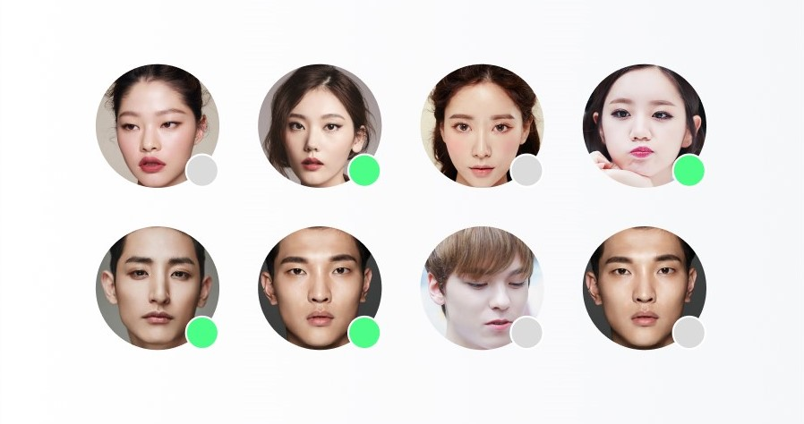
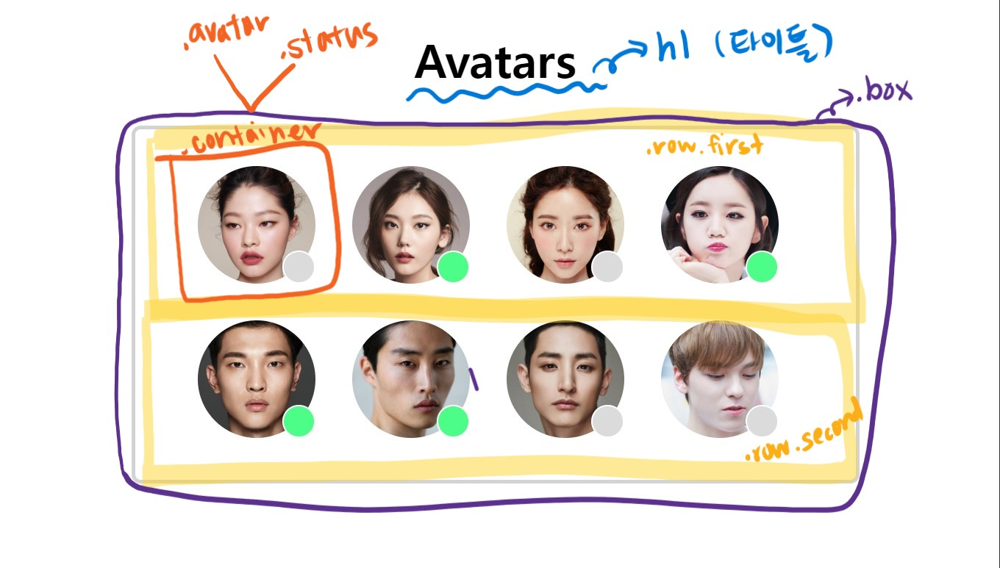
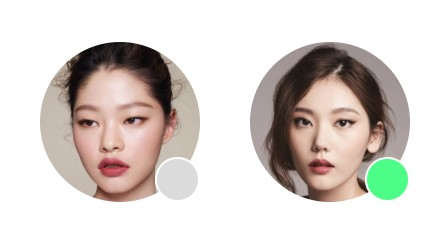

# Float를 활용한 CSS 실습 과제
### 과제 개요


- 위의 시안을 보고 css의 float 방식으로 똑같이 구현하는 과제를 진행했습니다.

<br/>

---

### 과제 내용


1. body 아래 h1 태그로 제목을 명시하고, div 태그로 콘텐츠 전체를 감싸는 박스 하나를 box라는 클래스로 생성해주었습니다. border는 연한 회색에 모서리를 둥글게 만들어주고, box-sizing을 border-box로 지정해서 개체 크기가 padding과 border를 포함하도록 해주었습니다. select 금지 속성도 추가하여 box 안의 콘텐츠가 select되지 않도록 막아두었습니다.

> css 코드

```css
.box {
  box-sizing: border-box;

  background-color: white;

  border: 2px solid lightgray;
  border-radius: 10px;
  
  width: 396px;
  height: 195px;
  
  padding: 20px;
  margin: 0 auto;
  
  overflow: hidden;
  position: relative;

  -webkit-user-select:none;
  -moz-user-select:none;
  -ms-user-select:none;
  user-select:none;
}
```

2. box 안에 div 태그를 이용해 아바타가 들어갈 공간을 두 줄로 나눈 다음 클래스를 row(first/second)로 지정, 좌우 padding을 자동으로 설정해서 안의 개체들이 적절히 중앙에 배치되도록 했습니다. 첫번째 row 아래에만 margin을 설정하여 각 row 사이 여백을 만들었습니다.

> html 코드

```html
    <body>
        <h1 class="title">Avatars</h1>
        <div class="box">
          <!-- 첫번째줄 -->
          <div class="row first">
            ...
            </div>
          <!-- 두번째줄 -->
          <div class="row second">
          ...
          </div>
        </div>
      </body>
```

> css 코드

```css
      .row {
        width: fit-content;
        overflow: hidden;
        padding: 0 auto;
      }

      .row.first {
        margin-bottom: 20px; 
      } 
```

3. 각 row 안에 프로필 사진과 온라인 상태 표시 아이콘을 포함하는 container를 div 태그를 이용해 네 개씩 생성해주었습니다. 역시 box-sizing을 border-box로 설정하고 float를 left로 설정하여 아이템들이 왼쪽에서부터 차례로 정렬되도록 했습니다. 추후 상태 표시 아이콘을 프로필 사진 앞에 중첩 배치하기 위해 부모 요소인 container의 position을 relative로 설정해주었습니다.
4. container에는 오른쪽 margin을 20px씩 주고 첫번째로 오는 container에만 왼쪽 margin을 줘서 아이템들이 한 줄 안에 일정한 간격을 두고 배치되도록 했습니다.

> html 코드

```html
      <div class="row first">
        <div class="container first">
          <div class="avatar">
            
          </div>
          <div class="status inactive"></div>
        </div>
        <div class="container second">
          <div class="avatar">
            
          </div>
          <div class="status active">
          </div>
        </div>
        ...
```

> css 코드

```css
      .container {
        box-sizing: border-box;
        width: 64px;
        height: 64px;
        margin-right: 20px;
        overflow: hidden;
        float: left;
        position: relative;
      }
      .container.first {
        margin-left: 8px;
      }
```



4. 만들어 둔 container 안에 프로필 사진이 들어갈 프레임을 div 태그로 생성하고 avatar라는 클래스를 지정, 가로 세로 크기를 64px, over-flow를 hidden, border-radius를 50%로 설정해서 원의 형태로 만들어주었습니다.
5. 원형 프레임 안에 img 태그로 프로필 사진을 삽입하고 클래스를 face로 지정, 가로 세로 크기를 프레임과 같게 설정해주었습니다.

> html 코드

```html
      <div class="container first">
        <div class="avatar">
          
      </div>
```

> css 코드

```css
      .avatar {
        box-sizing: border-box;
        overflow: hidden;
        border-radius: 50%;
        width: 64px;
        height: 64px;
      }

      .face {
        width: 64px;
        height: 64px;
      }
```

5. 마찬가지로 container 아래에 div 태그를 이용해 상태 표시 아이콘을 만들고, 적절한 크기와 border 값을 설정한 다음 border-radius 역시 50%로 설정해서 원의 형태로 만들어주었습니다. 그리고 position을 absolute로 설절하고 relative인 부모 요소인 container 기준 오른쪽 아래 올 수 있도록 right과 bottom 값을 0으로 설정해주었습니다.

> html 코드

```html
      <div class="container first">
        <div class="avatar">
          
        </div>
        <div class="status inactive"></div>
      </div>
```

> css 코드

```css
      .status {
        width: 17.78px;
        height: 17.78px;
        box-sizing: border-box;
        position: absolute;
        bottom: 0;
        right: 0;
        border: 1px solid white;
        border-radius: 50%;
        overflow: hidden;
      }
```

6. 마지막으로 상태 표시 아이콘이 온/오프라인에 따라 구별될 수 있도록 각각의 경우에 active, inactive라는 클래스를 추가해준 다음, 배경 색상을 다르게 지정해주었습니다.

> html 코드

``` html
    <!-- 활성화 상태 -->
      <div class="status active"></div>
    <!-- 비활성화 상태 -->
      <div class="status inactive"></div>
```

> css 코드

```css
      .active {
        background-color: #4CFE88;
      }

      .inactive {
        background-color: #DBDBDB;
      }
```
