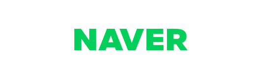
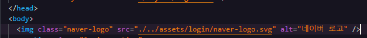
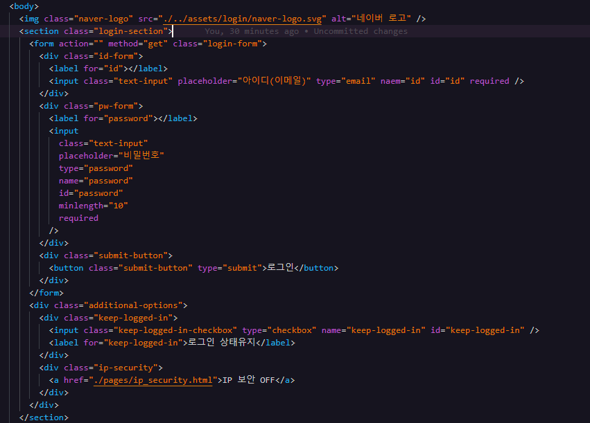
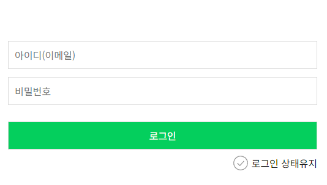
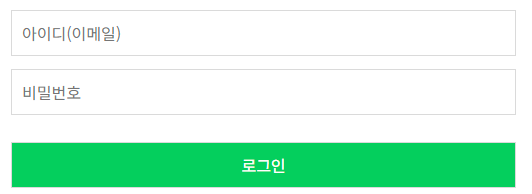
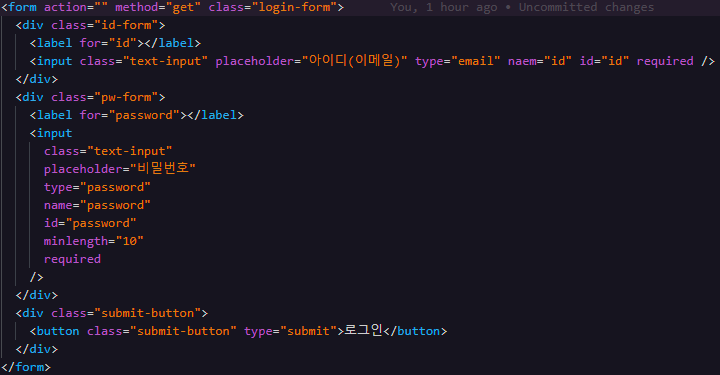
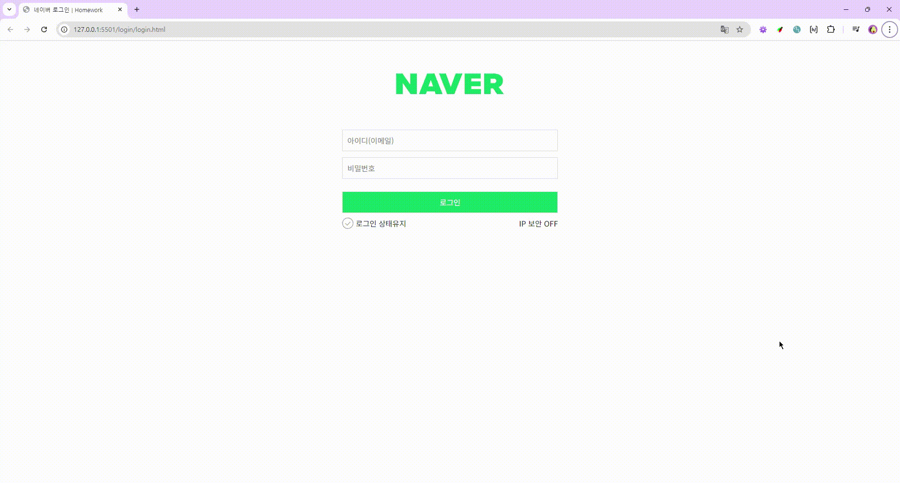
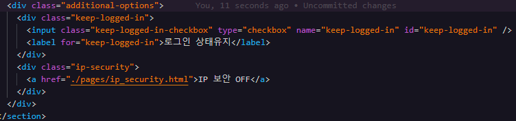
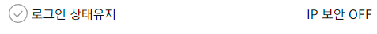

# 미디어 쿼리를 적용한 네이버 로그인 폼 구현 과제

### 과제 개요 및 완성본


- 네이버 반응형 로그인 창 만들기

### 과제 내용

1. HTML 마크업 구조

```
- Body
      - 네이버 로고(img -> svg)
      - 로그인 폼 전체 영역(section)
            - 로그인 폼(form)
                  - Id(div > input + label)
                  - Password(div > input + label)
                  - 로그인 버튼(div > button)
            - 로그인 상태유지 및 IP 보안 스위치 영역(div)
                  - 로그인 상태유지(div > input(checkbox) + label)
                  - ip 보안 스위치(div > a)
```

2. CSS (선언 순서대로 오름차순) 및 HTML 세부 코드

- 스타일 디폴트 값 설정을 위해 best reset을 가장 먼저 선언해주었습니다.

```css
@import "./../common/best-reset.css";
```

---

- body에 기본적인 폰트 색상과 사이즈를 조건에 맞춰 설정해주었습니다.

```css
body {
  /* 기본 폰트 색상과 폰트 사이즈 지정 */
  --primary-font-color: #121212;
  --primary-font-size: 1rem; /* 16px */

  color: var(--primary-font-color);
  font-size: var(--primary-font-size);

  /* 전체 창 크기 및 스크롤 설정 */
  width: 100%;
  inline-size: 100%;

  height: 100vh;
  block-size: 100vh;

  overflow: hidden;

  /* 보더 박스 지정 */
  box-sizing: border-box;
}
```

---

- 네이버 로고의 스타일을 조건에 맞춰 설정해주었습니다.





```css
/* 네이버 로고 */
.naver-logo {
  display: block;
  inline-size: 230px;
  margin-inline: auto; /* 가운데 배치 효과 */
  margin-block: 4.375rem; /* 로고 위 적당한 공백 주기 */
}
```

---

- 로그인 섹션 전체 영역을 section 태그로 감싸주었습니다.
- section 안에 form을 생성하여 아이디 input, 비밀번호 input, 로그인 button을 각각 div로 분리해서 넣어주었습니다.
- form 아래에는 div를 생성하여 로그인 상태유지 체크박스와 IP 보안 토글 스위치가 들어갈 하나의 컨테이너를 만들어주었습니다. 클래스 이름은 additional-option으로 지정했습니다.
- 위의 div 내부에 로그인 상태유지 input(checkbox)와 IP 보안 토글 스위치 링크를 마찬가지로 각각 div로 분리해서 넣어주었습니다.



---

- 로그인 섹션 전체 영역의 padding 값을 조건에 맞춰 설정해주었습니다.



```css
/* 로그인 섹션 전체 영역 */
.login-section {
  padding-left: 1.25rem; /* 20px */
  padding-right: 1.25rem;
  padding-inline: 1.25rem;

  margin-inline: auto;
}
```

---

- 아이디 비밀번호 입력 form 스타일링 부분입니다.
- input의 기본 폰트 사이즈와 가로 사이즈를 전역 변수 선언해주었습니다.
- input과 로그인 button의 기본 스타일을 설정해주었습니다.
- input 포커스 시 스타일을 설정해주었습니다.
- 로그인 버튼 스타일을 조건에 맞춰 설정해주었습니다.





```css
/* 아이디 비밀번호 입력 및 로그인 버튼 영역 */
.login-form {
  --login-form-font-size: 0.875rem; /* 14px */
  --login-form-block-size: 45px;

  width: 100%;
  inline-size: 100%;

  /* 인풋과 로그인 버튼 공통 스타일 */
  input,
  button {
    width: 100%;
    inline-size: 100%;
    padding: 0.625rem 0.625rem;
    margin: 0.4rem 0;

    font-size: var(--login-form__font-size); /* 14px */
    block-size: var(--login-form__block-size);

    outline: none;
    border: 1px solid #dadada;
    background-color: #fff;
  }

  /* 인풋 포커스 시 스타일 */
  input.text-input:focus {
    border: 1px solid #03cf5d;
    background-color: #e9f0fd;
  }

  /* 로그인 버튼 세부 스타일 */
  .submit-button button {
    margin-block-start: 1.25rem; /* 20px */
    margin-block-end: 0;

    font-size: var(--primary-font-size); /* 16px */
    color: #fff;
    background-color: #03cf5d;
  }
}
```

---

- 로그인 상태유지 체크박스의 스타일을 조건에 맞춰 설정해주었습니다. (가로 세로 크기 등)
- background-image 속성으로 체크박스가 체크되지 않았을 때와 체크되었을 때의 이미지를 각각 다르게 지정해주었습니다.




```css
/* 로그인 상태유지 영역 */
.keep-logged-in {
  display: flex;
  align-items: center;

  /* 체크박스 기본 이미지와 스타일 */
  .keep-logged-in-checkbox {
    width: 24px;
    height: 24px;

    background: no-repeat center center;
    background-image: url(./../../assets/login/checkbox-unchecked.svg);
    cursor: pointer;
    appearance: none;

    margin-inline-end: 0.3125rem; /* 배경이미지 오른쪽 여백 5px */
  }

  /* 체크박스 체크 시 이미지 */
  .keep-logged-in-checkbox:checked {
    background-image: url(./../../assets/login/checkbox-checked.svg);
  }
}
```

---

- 마지막으로 미디어 쿼리를 통해 뷰포트의 가로 크기가 768px가 넘어갈 때부터 보여줄, 데스크탑 모드의 스타일을 설정해주었습니다.
- 우선 로그인 영역의 가로 크기를 500px로 고정해주었습니다.
-
- 모바일 모드에서는 보여주지 않았던 IP 보안 스위치의 display 상태를 block으로 변환하고, a 태그인 해당 스위치를 누르기 전후, active, hover 상태일 때 글씨의 스타일이 모두 일정하도록 스타일을 설정해주었습니다.



```css
/* 데스크탑 반응형을 위한 스타일 */
body {
  /* 기존 모바일 스타일 */
  /* 로그인 상태유지 및 아이피 보안 스위치 */
  .additional-options {
    display: flex;
    flex-wrap: nowrap;
    justify-content: end;
    margin-block-start: 0.625rem;
  }

  .ip-security {
    display: none;
  }

  /* 데스크탑 반응형 css */
  @media (min-width: 768px) {
    /* 로그인 영역 가로 크기 지정 */
    .login-section {
      width: 500px;
      inline-size: 500px;
    }

    /* 로그인 상태유지 및 아이피 보안 스위치*/
    .additional-options {
      justify-content: space-between;
    }

    .ip-security {
      display: block;
      font-size: var(--primary-font-size);

      a:link,
      a:visited,
      a:hover,
      a:active {
        text-decoration: none;
        color: #121212;
      }
    }
  }
}
```

---

3. 과제를 마친 소감

```
  반응형을 제대로 만들어보는 것은 처음입니다.
  작년 프로젝트 과정에서는 디바이스마다 디자인이 무너지는 변수들을 하나하나 확인하고 그때마다 계속해서 CSS를 수정했었는데,
  처음부터 설계를 하고 시작하니 훨씬 깔끔하고 효율적으로 느껴졌습니다.

  자바스크립트를 사용하지 않고 오로지 html과 css만을 이용해 버튼의 토글을 구현하거나 input 유효성 에러 문구를 구현하는 일이 어렵게 느껴졌습니다.
  검색을 열심히 해보았지만, 에러 문구 띄우기에 대해서는 결국 답을 얻지 못했습니다. 그 부분이 아쉬움으로 남습니다.
```
